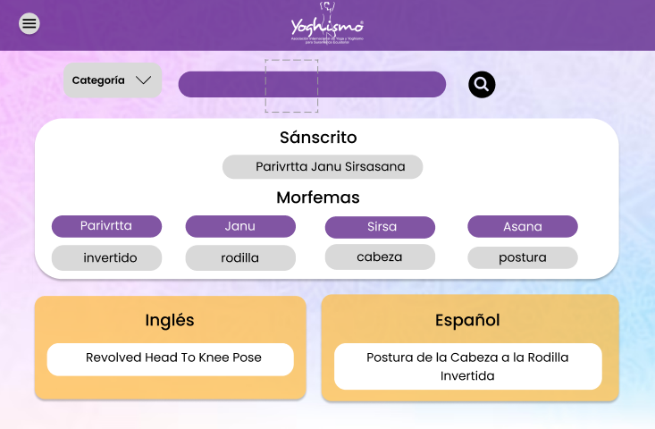

# ESCUELA POLITÉCNICA NACIONAL

## TECHNOWL S.A

---
Integrantes:

- Chalacama Erick
- Román Paul
- Salazar Santiago
- Suntasig Ariel
- Yánez David

Versión: Primera
---
# Documentación del diseño del sistema de traducción YOGA YOGHISMO
El diagrama de casos de uso mostrado en la Figura 1 permite identificar a los actores que van a interactuar con el sistema y a su vez las funcionalidades con las que deberá contar el sistema. La traducción a español e inglés al ingresar una palabra en sanscrito y la posterior visualización de los morfemas son las funcionalidades con las que el sistema deberá contar. 

*Figura 1: Diagrama de casos de uso del sistema de traducción*

En la Figura 2 se puede apreciar el diagrama de clases del sistema de traducción. Se puede observar que se tendrán dos clases base llamadas morpheme y yogaPosture. Estas dos serán usadas por la clase YogaPostureService, que posteriormente se usará como el elemento "modelo" dentro de un modelo vista controlador. 

Considerando esto, se puede apreciar que la clase YogaPostureController es el nexo entre la vista(clase que se encarga de mostrar los elementos en pantalla) y el modelo(Clase encargada de gestionar los datos y la lógica del negocio.

*Figura 2: Diagrama de clases del sistema de traducción*

En la Figura 3 se puede observar una representación visual del diseño del proyecto. Esto se usa comúnmente en diseño gráfico y desarrollo de productos para dar una vista previa de cómo se verá el producto final para esta ocasion se uso para mostrar la version 1.0 del proyecto realizado. Los mockups pueden ser estáticos o interactivos, y suelen ser herramientas valiosas en el proceso de diseño para obtener retroalimentación antes de la implementación final. 

*Figura 3: Mockup del sistema de traducción*

Además, se adjunta el enlace donde se desarrollo el diseño del sistema de traducción:

[ Mockup del sistema](https://www.figma.com/file/FCIhMwdpiagLvhLiKOsORq/Calidad-de-Software?type=design&node-id=0%3A1&mode=design&t=nZxJuCBgCuSAjgHC-1)